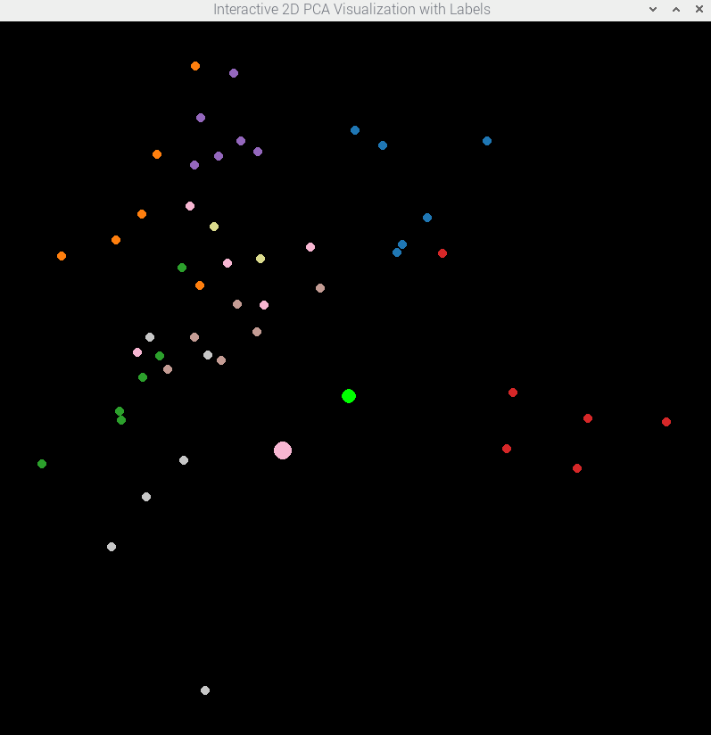
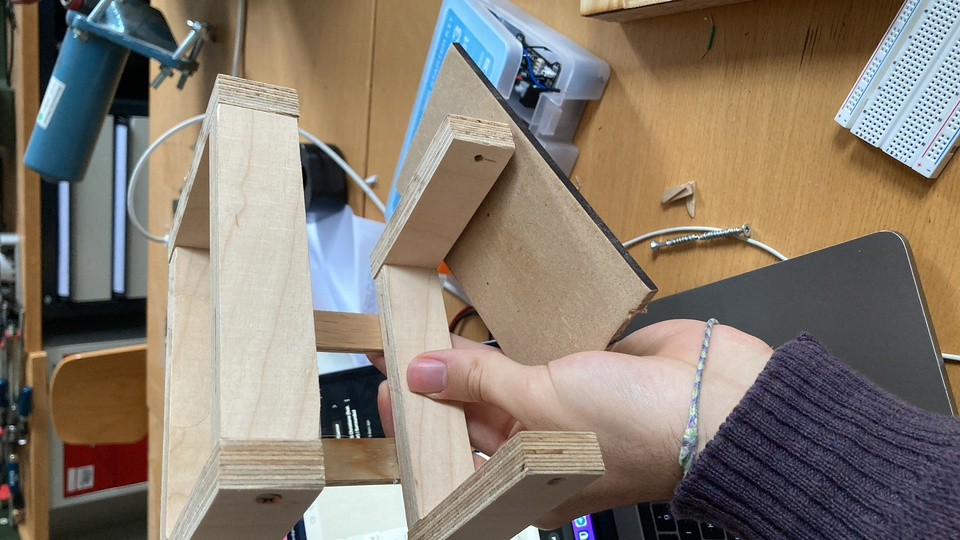
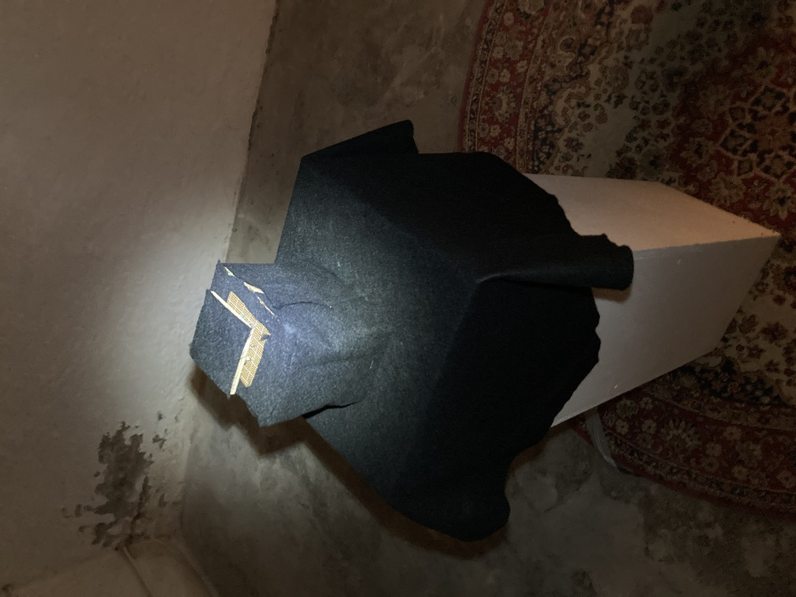
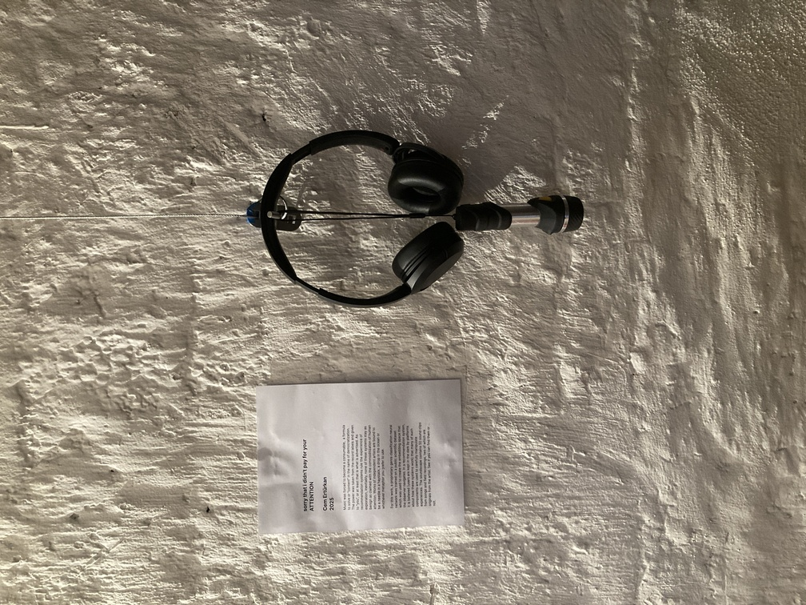

# sorry that i didn't pay for your ATTENTION
This is an interactive arts installation exhibited in Bauhaus University's Winterwerkschau 2025 between the dates (07.02-09.02). 

## Materials and tools used
- Raspberry Pi 4B (2018)
- Wood repurposed for the frame
- Black wool cloth used to cover wiring 
- Soldering to stabilize sensor circuitry
- Wood glue and silicon gun as adhesive for the frame
- 4 photoresistors
- 4 10K resistors
- An ADC chip (needed to convert the analog signal from the photoresistors to a digital format readable by the Pi)


## Software
- A virtual env with Python == 3.10.14


## Implementation

### Embeddings
The audio embedding space that this installation makes use of was created using the ResNet genre classification model trained in the repo [FFT Recommendation](https://github.com/cemrtkn/FFT_recommendation). The data used to train the model is the "small" variant of the [FMA](https://github.com/mdeff/fma) dataset with 8000 30 second long sound clips from songs and field recordings labeled into 8 genres/classes. Without going too much into the details, the conversion of sound clips to embeddings is as follows:
1. Take 30 sec long clips from songs and field recordings at 44.1 kHz as a 16 bit audio.
2. Run it through the process_audio.py script at [FFT Recommendation](https://github.com/cemrtkn/FFT_recommendation/blob/master/src/process_audio.py) to obtain [Mel Spectrograms](https://medium.com/analytics-vidhya/understanding-the-mel-spectrogram-fca2afa2ce53) with shape (256, 646).
3. Remove the predictive head of the model to have the model produce embeddings.
4. Run the spectrograms through the model to collect 1024-dimensional embeddings.
5. PCA to bring 1024 dimensions to a 2D navigable graph.

This was done for 48 correctly classified (6 from each genre/class) of the 8000 clips in the FMA musical dataset alongside 2 of my originals.

### Interactive Piece

There are 4 photoresistors located at 90 degree angles to each other that represent the 4 directions in a 2D environment(up/right/down/left). The position approximation method went through some iterations but the current setup follows the logic:
- For every sensor, there is a baseline reading taken at the beginning of the script which is not updated because the room that this work was exhibited in was a constantly dark basement room.
- Take the intensity of light sensed by a photoresistor as 1/resistance_value, resistance_value being the value that is communicated to the Pi. This inversion happens because the working principle of a photoresistor is that the resistance decreases as the light intensity increases
- The closer the light source is to a sensor the higher the light intensity and the lower the resistance value.
- Divide the resistance value to the baseline reading every iteration to get the relative resistance
-  Subtract the opposite facing sensors' relative resistance values from each other to approximate a direction(up/down righ/left) and a distance to the origin.

This logic is only robust when the distance is in the mid-range (1-1.5 meters to the sensors directly shining at them) but results in reversed reaction when it is close and far. So farther away the observer is closer to the origin, closer they are farther out they are in the 2D space. This is due to this way of position approximation is not being suitable for this context.

A separate thread is initiated to keep a "timer" for 2 mins and if the song closest to the observer doesn't change in that duration, the sound is stopped.

The embedding space is a 800x800 [pygame](https://github.com/pygame) display with the origin at (400,400). Clipping is applied to keep the position value for the observer and the songs in bounds.



A pygame mixer with 1 channel is used with all 50 clips loaded in as "Sound". Clips are played in a loop until the timer stops the channel.

#### Run the script
1. Navigate to the directory
2. ```source venv/bin/activate```
3. Two modes are available:

    i. ```python main.py true``` -> to have the GUI showing position in the 2D embedding space  
    ii. ```python main.py false``` -> to run without GUI

A service that calls the script in the venv was created in the Pi that gets triggered upon boot. The script checks for HDMI connection when it is called and only runs interactive code if it is not attached meaning that the Pi is in its "installation mode". The GUI shows clips from different genres/classes in different colors and one can observe how some information about genre classification is reserved even at reduced dimensons.

### Build
It was important that the frame the installation was built into was easily taken apart for ease of debugging and checks. For that reason, neither the Raspberry Pi nor the circuitry was permanently attached to it. The structure was built with scrap wood rectangles with the one below having its bottom closed off by a wood plate. The higher rectangle was wide enough for all the cables and circuitry to fit but narrow enough to have the sensor board sit on top of it. The two rectangles were put together by two wood pieces and some wood glue. 




The prevent the light from bleeding into the opposite sensor from the other side of the installation as well as block light coming from above a small wooden blocking head was constructed and placed on top of the structure. To cover the circuitry and play into the "black box" analogy for recommendation systems a black wool cloth outer layer was put together.





## Intended Interaction
- The observer arrives in front of the room and reads the description.
- They take the wireless headphones and flashlight and go in the dark room.
- The flashlight is used to navigate in the room.
- The setup approximates a position of the observer making use of the light intensity detected.
- The observer listens to the sound clip they are closest to based on their position in the embedding space.




## Installation Description
Music was forced to become a consumable,  a formula to solve or “content” in the name of democratization. The power was taken from the record labels and given to “you”, or at least that is what is advertised. As recommendation systems rule the experience of exploration, inevitably, none of these systems stay as benign as claimed with the commoditization of human attention. Works of independent artists are bound to be a needle in a haystack, a drop in the ocean or whichever metaphor you prefer to use.

For this work, a proprietary genre classification neural network was trained on a public scientific dataset which was used to create the embedding space that the observer navigates. In a recommendation system, it is believed (users are kept in the dark by platforms about how these systems work) that many of such components are used to carefully manipulate experiences. The soundscape contains 50 sound clips from songs and field recordings, two of which are originals from the artist. See if you can find them or … not.